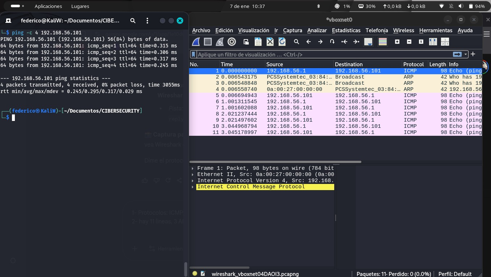
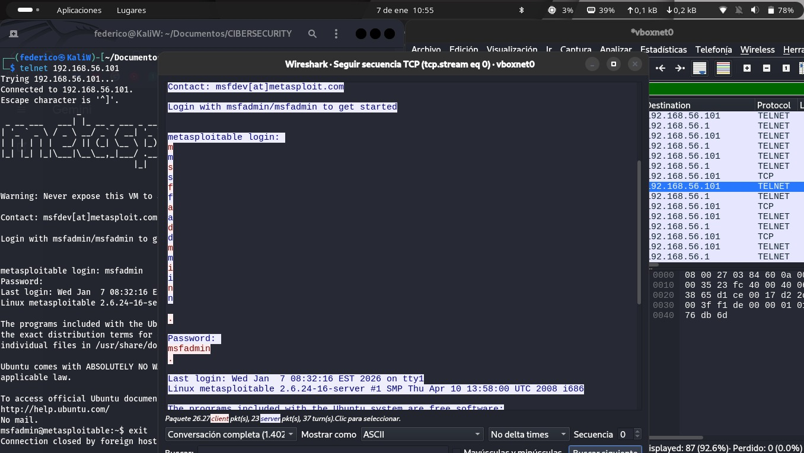

# Módulo 2: Intercepción y Análisis de Tráfico de Red

## Objetivo
Utilizar sniffers de paquetes (Wireshark) para visualizar el flujo de datos en la red, comprender la estructura de los protocolos TCP/IP y demostrar el riesgo de usar protocolos no cifrados.

## Herramientas
* **Sniffer:** Wireshark
* **Protocolos Analizados:** ICMP (Ping), ARP, Telnet (TCP Port 23)

## Análisis Forense

### 1. Visibilidad de Red (ICMP & ARP)

*Se verificó la resolución de direcciones (ARP) y el flujo de paquetes de control (ICMP) confirmando la conectividad bidireccional.*

### 2. Intercepción de Credenciales (Vulnerabilidad Telnet)

*Se capturó una sesión Telnet completa. Mediante la función "Follow TCP Stream", se reconstruyó la conversación, exponiendo el usuario `msfadmin` y la contraseña `msfadmin` en texto plano, demostrando la falta de cifrado.*

## Conclusión
El uso de protocolos heredados como Telnet expone a la organización a ataques de "Man-in-the-Middle". Se recomienda deshabilitar el puerto 23 y migrar estrictamente a SSH (Puerto 22) para garantizar la confidencialidad de los datos.
