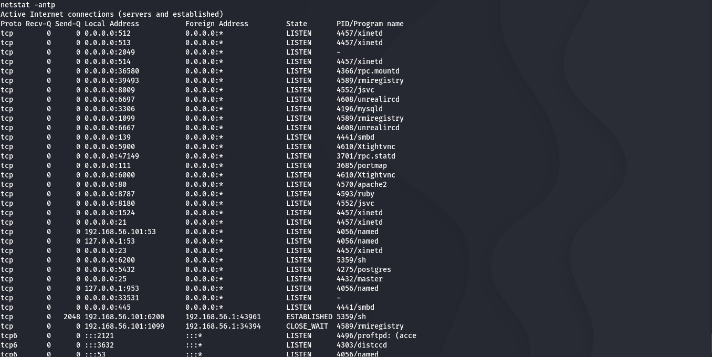

# Módulo 4: Análisis Forense y Detección de Intrusiones

## Objetivo
Realizar una búsqueda manual de indicadores de compromiso (IoC) en el sistema víctima tras el ataque, identificando persistencia y conexiones activas anómalas.

## Herramientas
* **Logs del Sistema:** `syslog`, `auth.log`, `vsftpd.log`.
* **Análisis de Red en Host:** `netstat`.

## Hallazgo Crítico

*El comando `netstat -antp` reveló una conexión TCP activa en estado ESTABLISHED en el puerto no estándar **6200**. El proceso asociado es `sh` (Shell), lo que indica una Reverse/Bind Shell interactiva controlada por la IP atacante `192.168.56.1`.*

## Conclusión
Se confirmó la intrusión exitosa. La presencia de una shell vinculada a un puerto de red es un indicador definitivo de compromiso (IoC) que requiere aislamiento inmediato del host.
