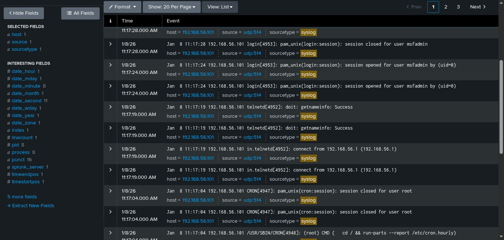

# Módulo 5: Despliegue de SIEM y Centralización de Logs

## Objetivo
Implementar una solución de monitoreo centralizado (SIEM) para ingerir, indexar y visualizar eventos de seguridad en tiempo real desde los activos de la red, eliminando la necesidad de revisión forense manual host-por-host.

## Stack Tecnológico
* **SIEM:** Splunk Enterprise (On-Premise)
* **Protocolo de Transporte:** Syslog (UDP 514)
* **Arquitectura:** Cliente-Servidor (Forwarder en Víctima -> Receiver en Kali)

## Configuración Realizada
1.  **Splunk Receiver:** Se habilitó la escucha en el puerto `UDP 514` con sourcetype `syslog`.
2.  **Log Forwarding:** Se configuró el daemon `sysklogd` en la víctima para redirigir eventos:
    `*.* @192.168.56.1` (IP del Host Monitor).
3.  **Ingesta de Datos:** Verificación de flujo de logs en tiempo real ante eventos de conexión (SSH/Telnet).

## Evidencia de Monitoreo

*La captura muestra la ingesta exitosa de logs provenientes del host `192.168.56.101`. Se observan eventos críticos como `session opened` y conexiones `telnetd` desde la IP atacante, confirmando la visibilidad total de la actividad en la red.*
