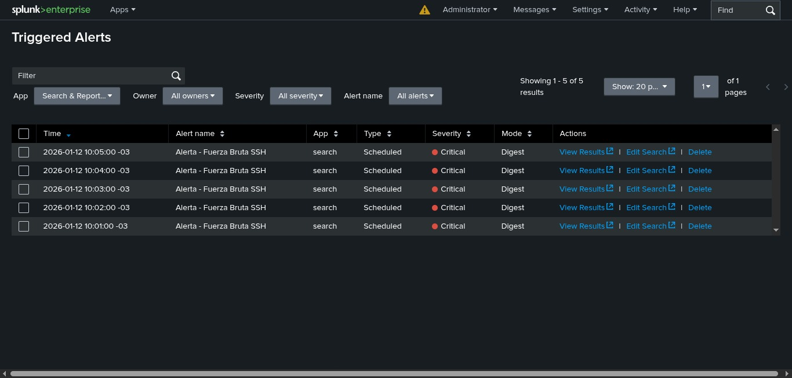

# Módulo 6: Automatización de Defensa con SIEM

## Objetivo
Configurar reglas de detección automatizadas (Detection Engineering) en Splunk para identificar patrones de ataque en tiempo real y generar alertas de alta prioridad, reduciendo el "Time-to-Detect" (TTD).

## Lógica de la Regla (SIEM Logic)
Se implementó una regla de correlación para detectar ataques de fuerza bruta sobre SSH:
* **Fuente de Datos:** Syslog (`udp:514`).
* **Patrón de Búsqueda:** `"Failed password"`.
* **Condición de Disparo:** `> 2 eventos` en una ventana de `1 minuto`.
* **Programación:** Ejecución CRON cada 60 segundos (`* * * * *`).

## Resultado
La regla detectó exitosamente la simulación de ataque, generando alertas con severidad **Critical** en el panel de "Triggered Alerts".

## Evidencia de Detección

*El dashboard muestra múltiples instancias de la alerta "Fuerza Bruta SSH" activadas consecutivamente, confirmando la detección persistente del ataque.*
